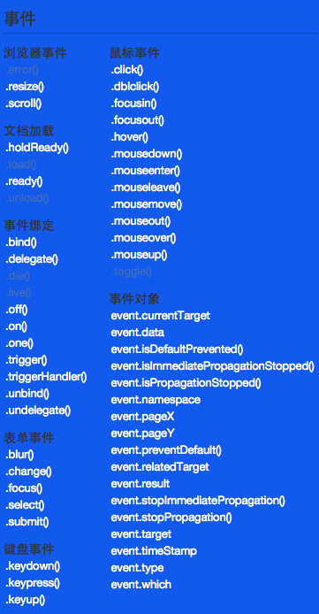

# 事件

事件处理中最头疼的就是浏览器兼容问题，jQuery封装了很好的API，可以方便的进行事件处理

在1.7之前的版本中jQuery处理事件有多个方法，作用各不相同，后来统一的使用on/off方法

- .on( events [,selector ] [,data ], handler(eventObject) )


1. events：一个或多个空格分隔的事件类型和可选的命名空间，或仅仅是命名空间，比如"click", "keydown.myPlugin", 或者 ".myPlugin"

2. selector：一个选择器字符串，用于过滤出被选中的元素中能触发事件的后代元素。如果选择器是 null 或者忽略了该选择器，那么被选中的元素总是能触发事件

3. data：当一个事件被触发时，要传递给事件处理函数的event.data

4. handler(eventObject)：事件被触发时，执行的函数。若该函数只是要执行return false的话，那么该参数位置可以直接简写成 false

看几个例子
```
// 普通事件绑定，最简单的用法
$('div').on('click', function(e){
    console.log(this);
    console.log(e);
});

// 事件委托或者事件代理，想让div 下面所有的span绑定事件，可以把事件绑定到div上
$('div').on('click', 'span', function(e){
    console.log(this);
    console.log(e);
});

// 可以在绑定的时候给事件处理程序传递一些参数
$('div').on('click', {name: 'Byron', age: 24}, function(e){
    console.log(e.data);
});
```
### 事件委托的意义

委托事件有一个优势，他们能在后代元素添加到文档后，可以处理这些事件。

在确保所选择的元素已经存在的情况下，进行事件绑定时，可以使用委派的事件，以避免频繁的绑定事件及解除绑定事件。

例如，这个已经存在的元素可以是 Model-View-Controller（模型 - 视图 - 控制器）模式中 View（视图） 的一个容器元素，或document，如果想监视所有文档中的冒泡事件的话，在加载任何其它 HTML 之前，document 元素在 head 中就是有效的，所以您可以安全的在 head 中进行事件绑定，而不需要等待文档加载完。

除了可以给未创建的后代元素绑定事件外（即上面提到的优势），代理事件的另一个好处就是，当需要监视很多元素的时候，代理事件的开销更小。例如，在一个表格的 tbody 中含有 1,000 行，下面这个例子会为这 1,000 元素绑定事件：
```
$( "#dataTable tbody tr" ).on( "click", function() {
  console.log( $( this ).text() );
});
```
一个委派事件的方法只在一个元素上绑定一个事件处理程序，下面的代码是绑定在tbody元素上，并且事件只会向上冒泡一层（从被点击的tr 到 tbody ）:
```
$( "#dataTable tbody" ).on( "click", "tr", function() {
  console.log( $( this ).text() );
});
```
jQuery事件委托一点儿都不神奇，就是利用事件触发后判断事件源是不是符合选择器参数来决定是否执行事件处理程序

- .off( events [, selector ] [, handler ] )

移除一个事件处理函数
```
function aClick() {
  $("div").show().fadeOut("slow");
}

$("#bind").click(function () {
  $("body").on("click", "#theone", aClick)
    .find("#theone").text("Can Click!");
});

$("#unbind").click(function () {
  $("body").off("click", "#theone", aClick)
    .find("#theone").text("Does nothing...");
});
```

- .trigger( eventType [, extraParameters ] )

根据绑定到匹配元素的给定的事件类型执行所有的处理程序和行为
```
$('#foo').on('click', function() {
  alert($(this).text());
});
$('#foo').trigger('click');
```
jQuery还提供了一些常见事件的快捷方式


