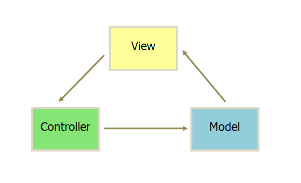

# 浅谈MVC、MVP、MVVM架构模式的区别和联系

## MVC、MVP、MVVM这些模式是为了解决开发过程中的实际问题而提出来的，目前作为主流的几种架构模式而被广泛使用。

### 一、MVC（Model-View-Controller）(最简单数据单线传递)

##### MVC是比较直观的架构模式，用户操作->View（负责接收用户的输入操作）->Controller（业务逻辑处理）->Model（数据持久化）->View（将结果反馈给View）。

MVC使用非常广泛，比如JavaEE中的SSH框架（Struts/Spring/Hibernate），Struts（View, STL）-Spring（Controller, Ioc、Spring MVC）-Hibernate（Model, ORM）以及ASP.NET中的ASP.NET MVC框架，xxx.cshtml-xxxcontroller-xxxmodel。

### 二、MVP（Model-View-Presenter）

##### MVP是把MVC中的Controller换成了Presenter（呈现），目的就是为了完全切断View跟Model之间的联系，由Presenter充当桥梁，做到View-Model之间通信的完全隔离。

Model提供数据，View负责显示，Controller/Presenter负责逻辑的处理。MVP与MVC有着一个重大的区别：在MVP中View并不直接使用Model，它们之间的通信是通过Presenter (MVC中的Controller)来进行的，所有的交互都发生在Presenter内部，而在MVC中View会直接从Model中读取数据而不是通过 Controller。

.NET程序员熟知的ASP.NET webform、winform基于事件驱动的开发技术就是使用的MVP模式。控件组成的页面充当View，实体数据库操作充当Model，而View和Model之间的控件数据绑定操作则属于Presenter。控件事件的处理可以通过自定义的IView接口实现，而View和IView都将对Presenter负责。

1. 各部分之间的通信，都是双向的。
2. View 与 Model 不发生联系，都通过 Presenter 传递。
3. View 非常薄，不部署任何业务逻辑，称为"被动视图"（Passive View），即没有任何主动性，而 Presenter非常厚，所有逻辑都部署在那里。

 

### 三、MVVM（Model-View-ViewModel）

##### 如果说MVP是对MVC的进一步改进，那么MVVM则是思想的完全变革。它是将“数据模型数据双向绑定”的思想作为核心，因此在View和Model之间没有联系，通过ViewModel进行交互，而且Model和ViewModel之间的交互是双向的，因此视图的数据的变化会同时修改数据源，而数据源数据的变化也会立即反应到View上。

MVVM 模式将 Presenter 改名为 ViewModel，基本上与 MVP 模式完全一致。唯一的区别是，它采用双向绑定（data-binding）：View的变动，自动反映在 ViewModel，反之亦然;

这种模式跟经典的MVP（Model-View-Presenter）模式很相似，除了你需要一个为View量身定制的model，这个model就是ViewModel。ViewModel包含所有由UI特定的接口和属性，并由一个 ViewModel 的视图的绑定属性，并可获得二者之间的松散耦合，所以需要在ViewModel 直接更新视图中编写相应代码。数据绑定系统还支持提供了标准化的方式传输到视图的验证错误的输入的验证。

这方面典型的应用有.NET的WPF，js框架Knockout/AngularJS/vue等。

