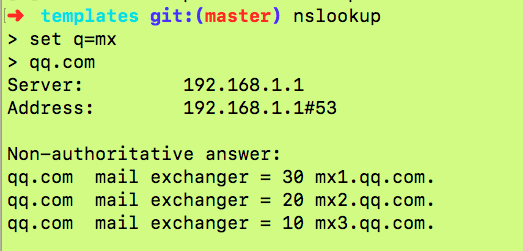

# 如何验证 Email 地址：SMTP 协议

## 一、SMTP 协议简介

SMTP 是"简单邮件传输协议"（Simple Mail Transfer Protocol）的缩写，基于 TCP 协议，用来发送电子邮件。

只要运行了该协议的服务器端（daemon），当前服务器就变为邮件服务器，可以接收电子邮件。
验证 Email 邮箱的基本思路如下。
```
找到邮箱所在域名的 SMTP 服务器
连接该服务器
询问有没有该邮箱
如果服务器返回 250 或 251 状态码，邮箱就是真的；如果返回 5xx（500～599），就是假的。
```
注意，即使服务器确认邮箱是真的， 也不代表邮件一定会发送到该邮箱，更不代表用户一定会读到该邮件。

## 二、查找域名的 MX 记录
它指向真正处理邮件的那台服务器。

输入nslookup命令后，会提示一个大于号，表示等待用户进一步输入。
set q=mx设定查询的是 MX 记录，第二行输入要查找的域名.

如果这一步查不到 MX 记录，该邮箱肯定是假的。


# 三、建立 TCP 连接
知道了邮件服务器的地址，就可以与它建立 TCP 连接了。SMTP 协议的默认端口是25。使用 Telnet 或 Netcat 命令，都可以连接该端口

- telent 
- nc 



服务器返回220状态码，就表示连接成功。

接下来，就可以使用 SMTP 协议的各种命令与邮件服务器交互了
