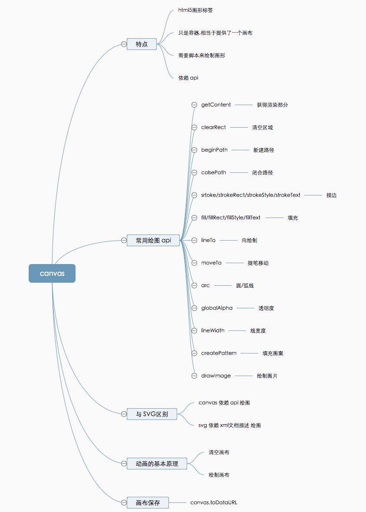
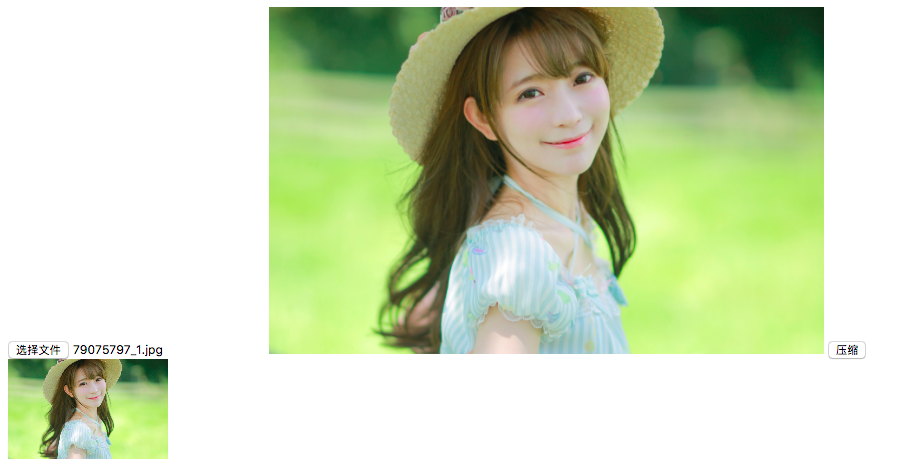
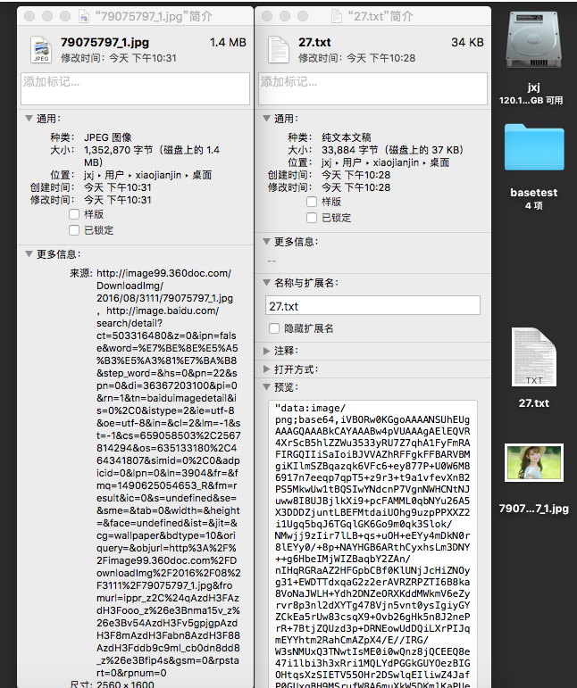

# 如何应用前端技术压缩图片

## 众所周知 canvas 是 html5 的一项新的绘图技术

### canvas 可以进行较复杂的绘图;利用这项技术可以作动画/作游戏



### 但是 canvas 还能有其他应用,本次说的就是利用此项技术进行轻量级的前端图片压缩

##### 用户图片先在页面显示，然后再获取图片的数据，放入已经创建设置好大小的 canvas 画布中(可以是隐藏状态的)， 保存画布图像;从而实现了压缩.压缩后为 base64格式更适合传输.

##### 不足
1. 这种方法图片不能太小,否则压缩反而变大
2. 必须是支持 html5 的浏览器
3. toDataURL输出的是 base64格式不是太灵活


js
```

       
        function getUrl(fil, id) {
            //建立绘图空间
            var Cnv = document.getElementById('myCanvas');
            var Cntx = Cnv.getContext('2d');//获取2d编辑容器
            
            var imgss =   new Image();//创建一个图片
            var agoimg=document.getElementById("ago");

            for (var intI = 0; intI < fil.length; intI++) {
                //图片回显
                var tmpFile = fil[intI];
                var reader = new FileReader();
                reader.readAsDataURL(tmpFile);
                //该方法会读取指定的 Blob 或 File 对象.读取操作完成的时候，readyState 会变成已完成（DONE），并触发 loadend 事件，同时 result 属性将包含一个data:URL格式的字符串（base64编码）以表示所读取文件的内容.
                reader.onload = function (e) {
                    url = e.target.result;
                    imgss.src = url;
                    agoimg.src=url;
                    agoimg.onload = function () {
                        //等比缩放
                        var m = imgss.width / imgss.height;
                         Cnv.height =100;//该值影响缩放后图片的大小
                         Cnv.width= 100*m ;
                        //img放入画布中
                        //设置起始坐标，结束坐标
                        Cntx.drawImage(agoimg, 0, 0,100*m,100);
                    }
                }
            }
        }


        function  pressImg(){//
            //获取canvas压缩后的图片数据
            var Pic = document.getElementById("myCanvas").toDataURL("image/png");
            //HTMLCanvasElement.toDataURL() 方法返回一个包含图片展示的 data URI .
            var imgs =document.getElementById("press");
            imgs.src =Pic ;
            console.log(`压缩后大小约${parseInt(Pic.length/1024)}kb`);
        }


```

html
```
<input type="file" id="fileId" name="fileId" value="上传图片"
       hidefocus="true" onchange="getUrl(this.files,this.id);"/>
<canvas id="myCanvas"     style="display: none" ></canvas>
< img src="" alt="" id="ago" style="width: 500px;"/>
<input type="button" value="ya suo->" onclick="pressImg()" />
< img src="" alt="" id="press"/>
```

### 1m 的图片缩小到30k, 有意思吧




## jxjweb.top