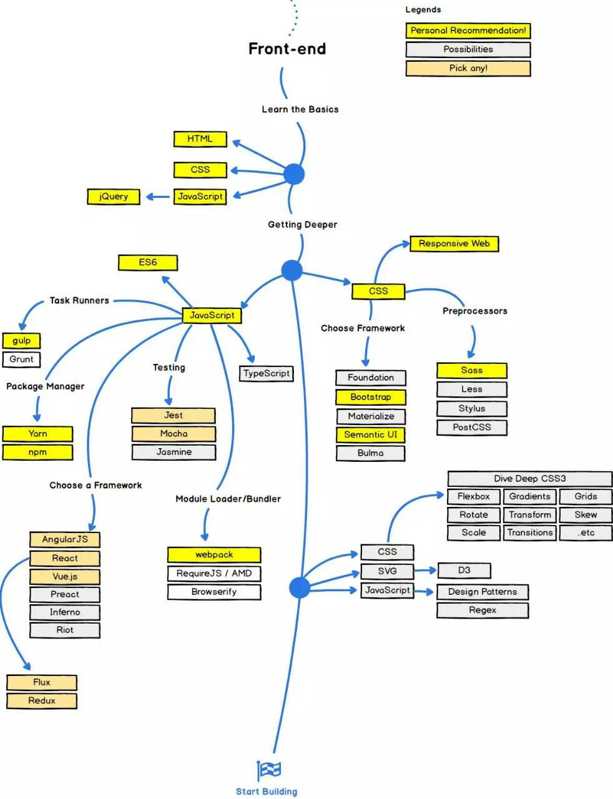

# 自适应布局
### 这个问题可以划分为，一边固定一边自适应宽度，上固定下固定中间自适应高度等等布局要求

### 关于左右自适应的，要看dom结构要求是并列还是嵌套，是否允许有父级元素，是否允许使用CSS3，是否有背景色，是否要两列等高

### 关于自适应高度的解决方案就略少一些，大致也是靠，CSS3的calc属性，内padding，绝对定位后拉伸，动态js计算等等解决方案

##### calc()可以使用数学运算中的简单加（+）、减（-）、乘（*）和除（/）来解决问题，而且还可以根据单位如px,em,rem和百分比来转化计算

# css垂直居中

### 这个问题又可以细分为，被垂直居中的元素是否定高，是文字还是块，文字是单行还是多行文字等等

1. 块定高: 绝相对定位加外边距倒退
2. 块不定高: 绝相对定位妙用 or 绝相对定位加css3变换
3. 单行字: vertical-align
4. 多行字: 包在块里

# 设计模式
### 这方面被问到的比较多的有观察者模式，职责链模式，工厂模式
### 主要是应用于js开发组件中会经常涉及，纯粹的页面业务逻辑可能涉及不多
##### 比如如何去设计一个前端UI组件，应该公开出哪些方法，应该提供哪些接口，应该提供哪些事件。哪部分逻辑流程应该开放出去让用户自行编写，如何实现组件与组件之间的通信，如何实现高内聚低耦合，如何实现组件的高复用等等。

