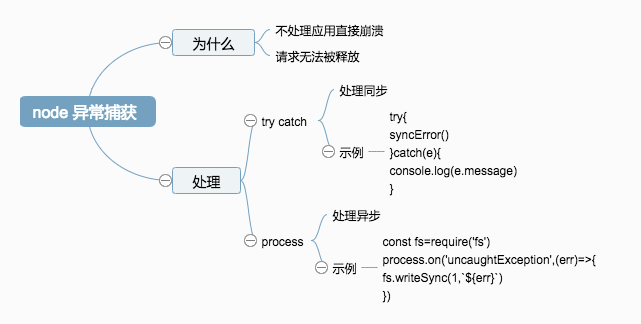

# node异常捕获



## 为什么要处理异常

1. 不处理直接导致程序奔溃
2. 导致请求无法被释放，直至连接超时

## 如何处理Node.js异常

```
// 每秒钟打印一次时间，确保程序没有奔溃,模拟程序始终在运行
(function loop() {
    console.log(new Date().getTime())
    setTimeout(function () {
        loop() 
    }, 1000)
})()
// 模拟同步代码块内出现异常
let syncError = () => {
    throw new Error('Sync Error')
}
// 模拟异步代码块内出现异常
let asyncError = () => {
    setTimeout(function () {
        throw new Error('Async Error')
    }, 100)
}
```

- try catch 方式 (处理同步)
```
try {
    syncError()
} catch (e) {
    /*处理异常*/
    console.log(e.message)
}
console.log('异常被捕获了，我可以继续执行')
```
但是try catch方式无法处理异步代码块内出现的异常，你可以理解为执行catch时，异常还没有发生.
```
try {
    asyncError()
} catch (e) {
    /*异常无法被捕获,导致进程退出*/
    console.log(e.message)
}
```

- process (处理异步)

process 对象是一个 global （全局变量），提供有关信息，控制当前 Node.js 进程.作为一个对象，它对于 Node.js 应用程序始终是可用的，故无需使用 require()

Event: 'uncaughtException'

如果Javascript未捕获的异常，沿着代码调用路径反向传递回event loop，会触发'uncaughtException'事件.

 Node.js默认情况下会将这些异常堆栈打印到stderr (【unix】标准输出(设备)文件，对应终端的屏幕)然后进程退出. 为'uncaughtException'事件增加监听器会覆盖上述默认行为.

'uncaughtException'事件监听器的回调函数，使用Error object作为唯一参数值.

```
const fs = require('fs');
process.on('uncaughtException', (err) => {
  fs.writeSync(1, `Caught exception: ${err}\n`);
});

setTimeout(() => {
  asyncError()
}, 500);

console.log('run this line');
```

- domain方式(废弃)
Node.js Domain(域) 简化异步代码的异常处理，可以捕捉处理try catch无法捕捉的异常


