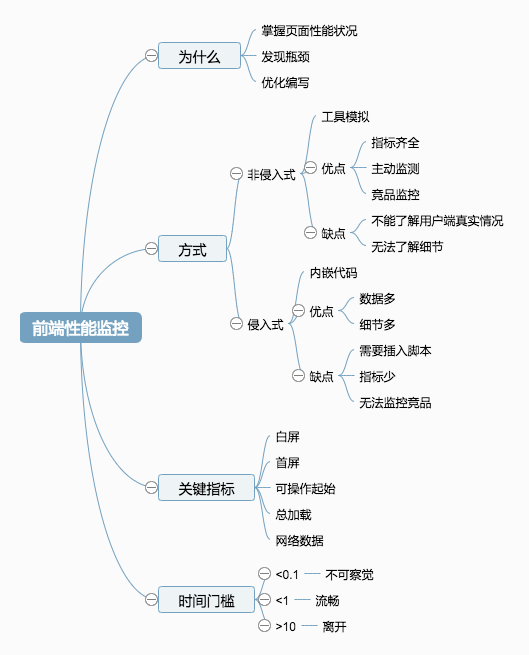

# 前端性能监控

## 为什么要监控性能

这是一个最基本的问题,为什么要关注和监控前端性能？对于公司来说,性能在一定程度上与利益直接相关.性能影响了用户体验.加载的延迟、操作的卡顿等都会影响用户的使用体验.尤其是移动端,用户对页面响应延迟和连接中断的容忍度很低.

谷歌也将页面加载速度作为 SEO 的一个权重,页面加载速度对用户体验和 SEO 的影响的调研有很多.

尽管性能很重要,开发迭代过程中难免会有所忽视,性能会伴随产品的迭代而有所衰减.特别在移动端,网络一直是一个很大的瓶颈,而页面却越来越大,功能越来越复杂.并没有简单的几条黄金规则就可以搞定性能优化工作,我们需要一套性能监控系统持续监控、评估、预警页面性能状况、发现瓶颈,指导优化工作的进行.

## 性能监控方法分类

工具模拟测试会在一定程度上与真实情况偏离,有时无法反映性能的波动情况.另外除了白屏首屏之类的基础指标,产品线同样关注产品相关的指标,例如广告可见、搜索可用、签到可用等,这些功能直接与页面 JS 加载相关,通过工具较难模拟

为了持续监控不同网络环境下用户访问情况与页面各功能可用状况,我们选择在页面中植入 JS 来监控线上真实用户访问性能

利用两种方式,形成一套完整多元的数据监控体系,为产品线的评估与优化提供可靠的数据

### 非侵入式 : (工具模拟测试)

优点: 指标齐全、客户端主动监测、竞品监控   

缺点: 无法知道性能影响用户数、采样少容易失真、无法监控复杂应用与细分功能   

### 侵入式 : (插入脚本测试)

优点:  真实海量用户数据、能监控复杂应用与业务功能、用户点击与区域渲染

缺点:   需插入脚本统计、网络指标不全、无法监控竞品  

## 采集性能数据

对于用户来说他感觉到的为什么页面打不开、为什么按钮点击不了、为什么图片显示这么慢.而对于工程师来说,可能关注的是 DNS 查询、TCP 连接、服务响应等浏览器加载过程指标.

根据用户的痛点,将浏览器加载过程抽取出五个关键指标,即:
1. 白屏时间
2. 首屏时间
3. 可操作起始时间
4. 总加载时间
5. 网络数据

##### 确定统计起点

我们需要在用户输入 URL 或者点击链接的时候就开始统计,因为这样才能衡量用户的等待时间.如果你的用户高端浏览器占比很高,那么可以直接使用Navigation Timing接口来获取统计起点以及加载过程中的各个阶段耗时.另外也可以通过 cookie 记录时间戳的方式来统计,需要注意的是 Cookie 方式只能统计到站内跳转的数据.

##### 白屏时间

白屏时间是用户首次看到内容的时间,也叫做首次渲染时间,chrome 高版本有 firstPaintTime 接口来获取这个耗时,但大部分浏览器并不支持,必须想其他办法来监测.仔细观察 WebPagetest 视图分析发现,白屏时间出现在头部外链资源加载完附近,因为浏览器只有加载并解析完头部资源才会真正渲染页面.基于此我们可以通过获取头部资源加载完的时刻来近似统计白屏时间.尽管并不精确,但却考虑了影响白屏的主要因素：首字节时间和头部资源加载时间.我们发现头部内嵌的 JS 通常需等待前面的 JS\CSS 加载完才会执行,是不是可以在浏览器 head 内底部加一句 JS .统计的头部加载时间正好跟头部资源下载时间相近,而且换成一个执行时间很长的 JS 也会等到 JS 执行完才统计.

##### 首屏时间

首屏时间的统计比较复杂,因为涉及图片等多种元素及异步渲染等方式.观察加载视图可发现,影响首屏的主要因素的图片的加载.通过统计首屏内图片的加载时间便可以获取首屏渲染完成的时间.统计流程如下：

首屏位置调用 API 开始统计 -> 绑定首屏内所有图片的 load 事件 -> 页面加载完后判断图片是否在首屏内,找出加载最慢的一张 -> 首屏时间

这是同步加载情况下的简单统计逻辑,另外需要注意的几点：
1. 页面存在 iframe 的情况下也需要判断加载时间
2. gif 图片在 IE 上可能重复触发 load 事件需排除
3. 异步渲染的情况下应在异步获取数据插入之后再计算首屏
4. css 重要背景图片可以通过 JS 请求图片 url 来统计(浏览器不会重复加载)
5. 没有图片则以统计 JS 执行时间为首屏,即认为文字出现时间

##### 可操作起始时间

用户可操作默认可以统计domready时间,因为通常会在这时候绑定事件操作.对于使用了模块化异步加载的 JS 可以在代码中去主动标记重要 JS 的加载时间,这也是产品指标的统计方式.

##### 总下载时间

总下载时间默认可以统计onload时间,这样可以统计同步加载的资源全部加载完的耗时.如果页面中存在很多异步渲染,可以将异步渲染全部完成的时间作为总下载时间.

##### 网络指标

1. 网络类型判断

对于移动端来说,网络是页面加载速度最大的影响因素,需要根据不同的网络来采取相应的优化措施,例如对于 2G 用户采用简版等.但 web 上没有接口获取用户的网络类型.为了获取用户网络类型,可以通过测速的方式来判断不同 IP 段对应的网络.测速例如比较经典的有 facebook 的方案.

2. 网络耗时统计

网络耗时数据可以借助前面提到 Navigation Timing 接口获取,与之类似的还有Resource Timing,可以获取页面所有静态资源的加载耗时.通过此接口可以轻松获取 DNS、TCP、首字节、html 传输等耗时.

###  分析性能数据

大数据处理需要借助 hadoop、Hive 等方式,而对于普通站点则任意一种后端语言处理即可.

##### 均值与分布

均值与分布是数据处理中最常见的两种方式.因为它能直观的表示指标的趋势与分布状况,方便进行评估、瓶颈发现与告警.处理过程中应去除异常值,例如明显超过阈值的脏数据等.

##### 时间门槛

0.1秒 : 0.1 秒是用户感知的最小粒度,在这个时间范围内完成的操作被认为是流畅没有延迟的

1.0秒 : 1.0 秒内完成的响应认为不会干扰用户的思维流.尽管用户能感觉到延迟,但 0.1 秒 -1.0 秒内完成的操作并不需要给出明显 loading 提示

10秒 : 达到 10 秒用户将无法保持注意力,很可能选择离开做其他事情

##### 多维分析

为了方便挖掘性能可能的瓶颈,需要从多维的角度对数据进行分析.例如移动端最重要的维度就是网络,数据处理上除了总体数据,还需要根据网络类型对数据进行分析.常见的维度还有系统、浏览器、地域运营商等.需要注意的是维度并不是越多越好,需要根据产品的特点及终端来确定.维度是为了方便查找性能瓶颈

 