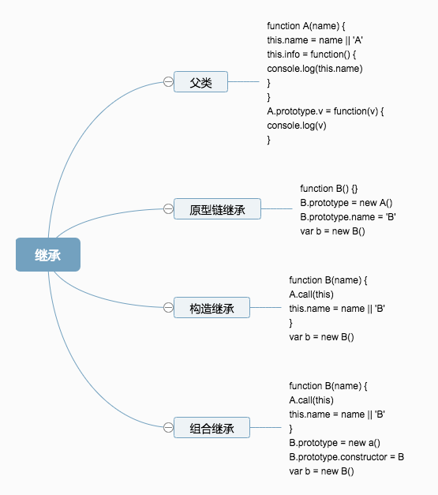

# 组合继承



组合继承,有时候也叫做伪经典继承，指的是讲原型链和借用构造函数的技术组合到一起，从而发挥二者之长.

思路：是使用原型链实现对原型属性和方法的继承，而通过借用构造函数来实现对实例属性的继承.

这样，通过在原型上定义方法来实现了函数复用，又能够保证每个实例都有自己的属性

```
//组合继承

function first(name) {
    this.name = name
    this.has = [1, 2, 3]
}
first.prototype.sayName = function() {
    console.log(this.name)
}

function second(name, size) {
    first.call(this, name)
    this.size = size
}
second.prototype = new first()
second.prototype.saySzie = function() {
    console.log(this.size)
}

let a1 = new second('a', 5)
a1.has.push(4)
console.log(a1.has)
a1.sayName()
a1.saySzie()

let b1 = new second('b', 6)
b1.has.push(5)
console.log(b1.has)
b1.sayName()
b1.saySzie()
```

### 特点：

1. 可以继承实例属性/方法，也可以继承原型属性/方法
2. 既是子类的实例，也是父类的实例
3. 不存在引用属性共享问题
4. 可传参
5. 函数可复用
6. 调用了两次父类构造函数，生成了两份实例（子类实例将子类原型上的那份屏蔽了）
