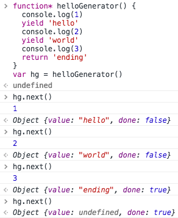
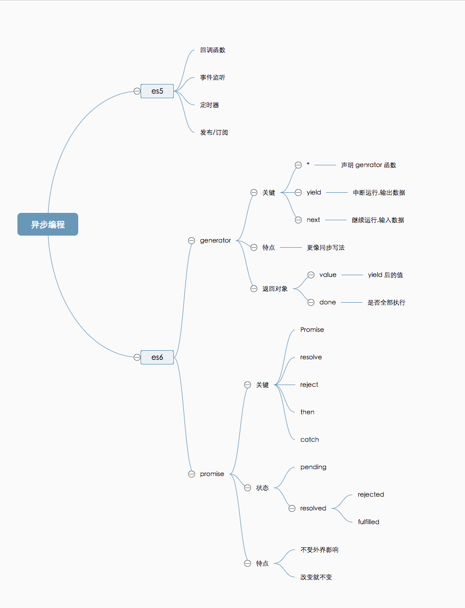

# generator 与 promise

### Generator

Generator 函数是 ES6 提供的一种异步编程解决方案.

```
function* helloGenerator() {
  console.log(1)
  yield 'hello'
  console.log(2)
  yield 'world'
  console.log(3)
  return 'ending'
}
var hg = helloGenerator()
hg.next()
hg.next()
hg.next()
hg.next()
```



Generator 函数是一个状态机，封装了多个内部状态,调用 Generator 函数后，该函数并不完全执行，返回的也不是函数运行结果，而是一个指向内部状态的指针对象
必须调用遍历器对象的next方法，使得指针移向下一个状态

Generator 函数是分段执行的，yield表达式是暂停执行的标记，而next方法可以恢复执行

执行到 yield 时,代码段暂停运行,并返回一个对象;调用 next 可以继续运行,并带入新的数据替换 yeild后的表达式; 函数继续运行

Generator 函数最大的优点是可以以同步的编程结构实现异步函数运行


### promise

Promise 是异步编程的一种解决方案.

使用时需要两步:
1. new 出一个 Promise 对象,需要传入一个函数,函数需要两个参数: resolve,reject;如果异步操作成功则调用 resolve 函数,反之调用 reject 函数.
2. promise 对象调用其 prototype.then函数,需要传入两个(或者一个)函数,对回调状态进行处理.

基本写法:
```
const promise = new Promise(function(resolve, reject) {
  if (/* 异步操作成功 */){
    resolve(value)
  } else {
    reject(error)
  }
});
promise.then(function(value) {
}, function(error) {
});
```

ajax例子:
```
const getJSON = function(url) {
  const promise = new Promise(function(resolve, reject){
    const handler = function() {
      if (this.readyState !== 4) {
        return
      }
      if (this.status === 200) {
        resolve(this.response)
      } else {
        reject(new Error(this.statusText))
      }
    }
    const client = new XMLHttpRequest()
    client.open("GET", url)
    client.onreadystatechange = handler
    client.responseType = "json"
    client.setRequestHeader("Accept", "application/json")
    client.send()

  })
  return promise
}

getJSON("/posts.json").then(function(json) {
  console.log('Contents: ' + json)
}, function(error) {
  console.error('出错了', error)
})
```




##### generator与 promise 联合使用

```
var fetch = require('node-fetch')
function* gen(){
  var url = 'https://api.github.com/users/github'
  var result = yield fetch(url)
  console.log(`函数继续运行${result}`)
}
//执行
var g = gen()
var result = g.next()

result.value.then(function(data){
  return data.json()
}).then(function(data){
  g.next(data)
})
```
首先执行 Generator 函数，获取遍历器对象，然后使用next方法，执行异步任务的第一阶段。由于Fetch模块返回的是一个 Promise 对象，因此要用then方法调用下一个next方法。